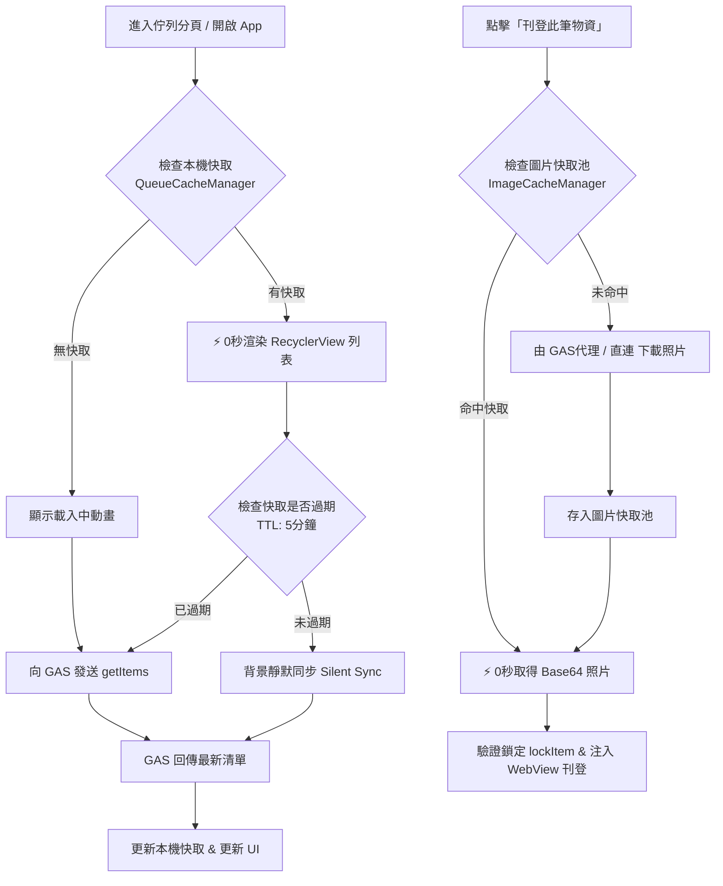

# 05_Android專屬App：物資清單與圖片快取架構規劃書 (App Cache Architecture Plan)

## 一、背景與現狀分析

### 1. 現狀痛點
1. **佇列開啟延遲**：每次切換至「待刊物資佇列」分頁時，App 必定發起網路請求向 GAS 抓取資料，需等待 1.5~3 秒的轉圈圈（ProgressBar）。
2. **離線無可讀性**：在訊號不佳或無網路環境下，佇列直接呈現錯誤訊息，無法查看既有物資資料。
3. **圖片重複下載耗時**：每次點擊「刊登此筆物資」時，App 皆需向 Google Drive / GAS 下載照片為 Base64（約耗時 2~5 秒）。若因驗證碼錯誤或手動取消而重試，會再度重複下載相同照片，消耗手機行動網路流量並增加等待時間。

---

## 二、快取架構設計目標

1. **⚡ 0 秒瞬間秒開（SWR 模式）**：進入佇列瞬間自本機磁碟/快取讀取資料，列表立即呈現，徹底消滅白畫面與轉圈等待。
2. **🔄 5 分鐘有效期限（TTL）與背景靜默同步**：5 分鐘內開啟直接使用快取；若過期或背景連線成功，無感更新資料。
3. **🖼️ 圖片按需記憶體/磁碟快取（Cache-on-Demand）**：成功下載過的照片 Base64 保存在快取池中，同筆物資重複帶入或失敗重試時 0 秒秒速注入。
4. **🔒 資料一致性保證**：本機進行「刪除物資」、「解除鎖定」、「刊登完成」時，即時回寫本機快取；「刊登此筆」時依然保有向 GAS 驗證鎖定之防衝突機制。

---

## 三、模組架構設計



---

## 四、具體實作規劃

### 模組 1：物資清單快取管理器 (`QueueCacheManager.kt`)
- **儲存位置**：使用 `context.cacheDir/queue_cache.json`（或 `SharedPreferences`）。
- **快取資料結構**：
  ```kotlin
  data class QueueCacheEntity(
      val timestamp: Long,
      val items: List<GoodsItem>
  )
  ```
- **核心方法**：
  - `loadQueue(): Pair<List<GoodsItem>, Long>?`：讀取快取清單與時間戳。
  - `saveQueue(items: List<GoodsItem>)`：保存清單並記錄當前時間戳。
  - `updateItemStatus(row: Int, newStatus: String)`：單筆狀態（待刊登/刊登中）即時回寫快取。
  - `removeItem(row: Int)`：刪除或完成刊登後自快取剔除。
  - `clearCache()`：手動清理。

### 模組 2：圖片快取池 (`ImageCacheManager.kt`)
- **雙層快取架構**：
  1. **L1 記憶體快取 (Memory Cache)**：使用 Android 原生 `LruCache<String, PhotoItem>`，上限預設 15 張圖片（約 3~5 筆物資），速度最快（微秒級）。
  2. **L2 磁碟快取 (Disk Cache)**：儲存於 `context.cacheDir/goods_photos/`，檔名為 `goods_{fileId}.jpg`，由 Android 系統在空間不足時自動回收。
- **快取命中邏輯**：
  - 以圖片 `fileId ?: downloadUrl ?: originalUrl` 為鍵值。
  - 當呼叫 `preparePhotosBase64()` 時：
    - 優先讀取 L1 記憶體快取；
    - 次之讀取 L2 磁碟檔案；
    - 皆無時才發起網路請求（GAS 代理 `getImageBase64` 或直連下載），下載後同時寫入 L1 與 L2。

### 模組 3：`MainActivity.kt` 流程整合
1. **初始化與分頁切換**：
   - 進入佇列時，先執行 `QueueCacheManager.loadQueue()`。
   - 若有快取立即顯示，同時判斷 `System.currentTimeMillis() - timestamp < 5 * 60 * 1000`：
     - 若未過期：發動背景靜默同步（`refreshQueue(silent = true)`），不彈出遮罩。
     - 若已過期：正常帶轉圈提示發起網路刷新。
2. **手動刷新（Pull-to-Refresh / 按鈕）**：
   - 點擊刷新按鈕或下拉刷新時，傳入 `force = true`，強制穿透快取向雲端索取最新資料。
3. **物資狀態異動聯動**：
   - 刪除物資（`handleDeleteItem`）：成功後即時自快取剔除該列。
   - 解除鎖定（`unlockItemAndRefresh`）：成功後將快取中該項狀態改為「待刊登」。
   - 刊登完成（`markCompleted`）：成功後自快取移除。

---

## 五、預計檔案變更清單

| 操作 | 檔案路徑 | 說明 |
| :---: | :--- | :--- |
| **[NEW]** | `app/src/main/java/.../data/QueueCacheManager.kt` | 負責佇列 JSON 檔案快取、TTL 判定與本機操作即時回寫 |
| **[NEW]** | `app/src/main/java/.../data/ImageCacheManager.kt` | 負責圖片 LruCache 記憶體快取與磁碟 Base64 快取 |
| **[MODIFY]** | `app/src/main/java/.../data/GasRepository.kt` | 在 `preparePhotosBase64()` 中接入 `ImageCacheManager` |
| **[MODIFY]** | `app/src/main/java/.../MainActivity.kt` | 實作 SWR 秒開流程、背景靜默同步與快取同步回寫 |

---

## 六、效益評估

1. **使用者體驗大幅躍升**：
   - 啟動 App 或切換佇列：從 2~4 秒降至 **0 秒秒開**。
   - 刊登失敗或重複帶入：圖片下載從 3~5 秒降至 **0 秒瞬間帶入**。
2. **網路與雲端資源節約**：
   - 減少 80% 以上不必要的 GAS `getItems` 與 Google Drive 圖片下載請求。
   - 徹底符合 Google Apps Script 配額保護最佳實踐。
