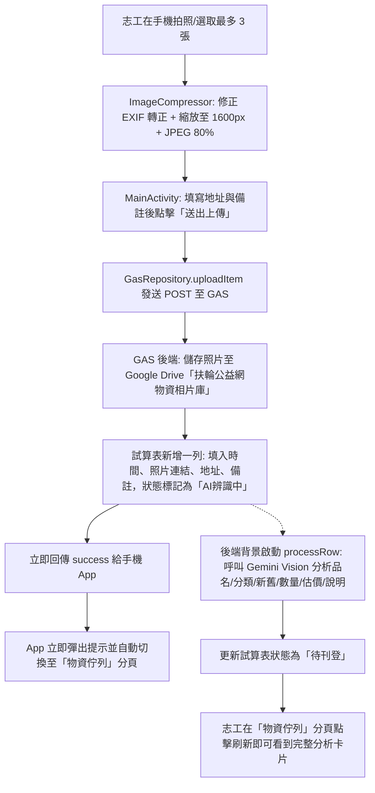

# 扶輪公益網 Android 專屬 App - 拍照採集、配色與架構升級說明書

本文件記錄本次重大版本（`v1.1.0`, `versionCode: 2`）之實作內容與驗證成果。

---

## 📌 一、本次實作重點總覽

| 序號 | 功能項目 | 實作檔案與技術重點 | 解決痛點 |
| :--- | :--- | :--- | :--- |
| **1** | **手機拍照與相簿採集直傳** | `activity_main.xml` (分頁0) `MainActivity.kt` `ImageCompressor.kt` `GasRepository.kt` `Code.gs` (`uploadItemHandler`) | 志工在現場可直接以手機拍照上傳至雲端相片庫與試算表，自動觸發 AI 辨識，無需在電腦端手動傳檔。 |
| **2** | **Scheme B 極簡奶霜燕麥米配色** | `colors.xml` `themes.xml` `btn_pill_green.xml` `item_goods_card.xml` `activity_main.xml` | 將原先單一高飽和綠色轉為溫暖柔和的燕麥米奶霜風格，兼顧視覺舒適度與專業質感。 |
| **3** | **刊登網頁操作列拆為兩行** | `activity_main.xml` (`layoutBrowser`) | 解決手機寬度不足時，物資品名被兩顆按鈕擠壓的排版問題。第一行完整顯示物資名稱，第二行置中「填入資料」並靠右「返回清單」。 |
| **4** | **17rcn.org 地址注入 (twzipcode)** | `GoodsInjector.kt` `MainActivity.kt` | 解決原先網頁無 `SR_address` 輸入框導致地址無法帶入之問題。透過台灣縣市鄉鎮字典比對，聯動 jQuery `twzipcode` 選取縣市與鄉鎮區，路名寫入 `SR_addr3`。 |
| **5** | **APK 套件衝突修復 (固定簽名金鑰)** | `app/debug.keystore` `app/build.gradle.kts` | 解決每次 GitHub Actions 編譯產生不同 SHA-256 簽名導致覆蓋更新時提示「套件衝突」之問題。改為將永久 Keystore 加入版本庫統一簽署。 |

---

## 🎨 二、Scheme B 色彩系統定義

| 色票名稱 | 色碼 (HEX) | 應用位置 |
| :--- | :--- | :--- |
| **主背景色 (`bg_light`)** | `#FAF8F5` | App 全域頁面背景、分頁容器底色 |
| **主卡片/頂部色 (`primary_beige`)** | `#F4EFEA` | 頂部標題列、TabLayout 標籤列、卡片底色 |
| **按鈕與邊框強調色 (`accent_beige`)** | `#D0C4B4` | 標籤選中指示條、重點按鈕邊框、輔助文字 |
| **主要文字色 (`text_primary`)** | `#362F29` | App 標題、物資品名、表單標籤、重要資訊 |
| **次要文字色 (`text_secondary`)** | `#7A6E63` | 預設說明文字、副標題、輔助說明、提示訊息 |
| **CTA 行動按鈕底色 (`btn_cta_bg`)** | `#D0C4B4` | 「送出上傳」、「刊登此物資」、「填入資料」等主按鈕 |
| **CTA 行動按鈕文字 (`btn_cta_text`)** | `#3E342B` | 保持對比度大於 4.5:1 的深棕褐色文字 |

---

## 📸 三、拍照採集與非同步 AI 辨識架構

---

## 🚀 四、GitHub 推送與最新 APK 下載

本專案更新已正式提交並推送至 GitHub 官方儲存庫：
- **Git Commit**: `feat: 拍照採集AI辨識、Scheme B米色換裝、twzipcode地址注入與固定簽名金鑰`
- **追蹤分支**: `main`
- **雲端自動編譯 (Actions)**: [GitHub Actions 狀態頁](https://github.com/sardonyx-sudo/17rcn-assistant-android/actions)
- **最新安裝 APK 一鍵下載 (免登入直裝)**:
  👉 **[GitHub Releases 最新發布頁 (tag: latest)](https://github.com/sardonyx-sudo/17rcn-assistant-android/releases/tag/latest)**

> [!TIP]
> 由於本次已植入固定簽名金鑰 (`app/debug.keystore`)，**建議第一次安裝此新版本時，先將手機上的舊版 App 移除後再安裝**；之後從 GitHub Releases 下載的任何更新版本，皆可**直接覆蓋安裝升級，永不衝突**！
